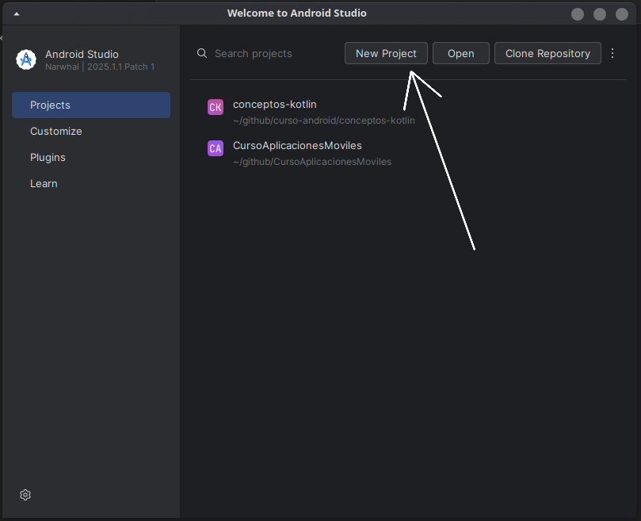
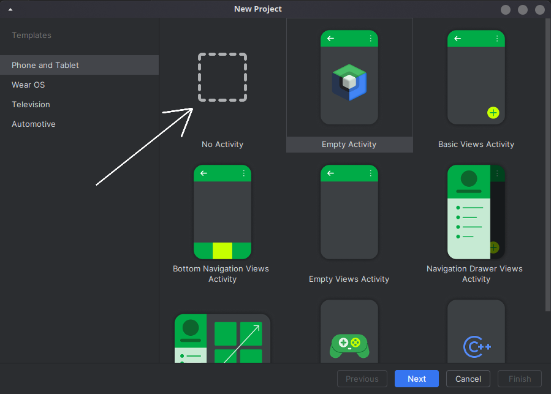
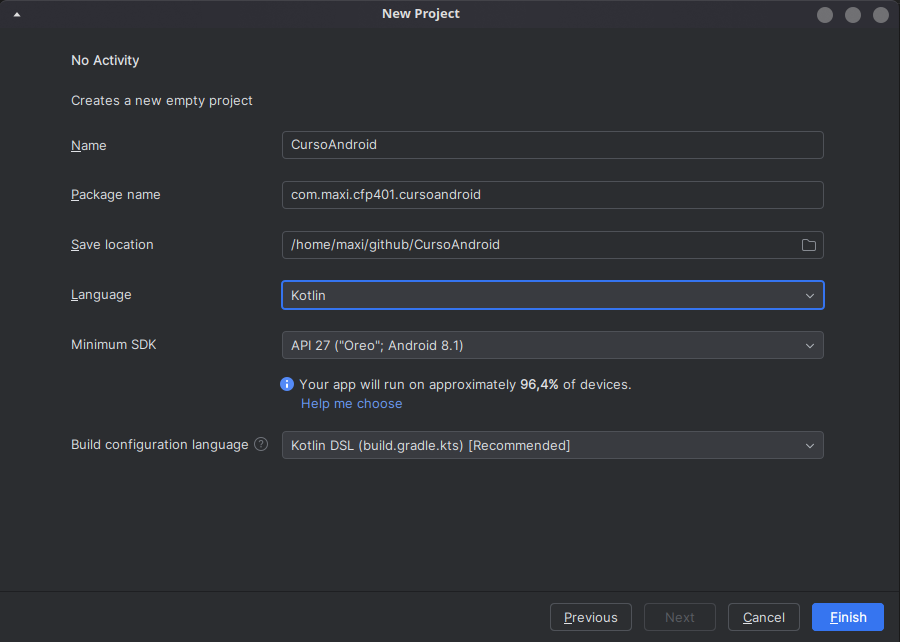

# Crear proyecto y archivos en Android Studio
- [1er paso - Abrir y crear Nuevo Proyecto](#1er-paso)
- [2do paso - Seleccionar No Activity](#2do-paso)
- [3er paso - Completar los datos del proyecto](#3er-paso)
- [4to paso - Esperar a que cargue el proyecto](#4to-paso)
- [5to paso - Crear un archivo Kotlin](#5to-paso)

## 1er paso
### Abrir Android Studio y clickear en "New Project"
  

## 2do paso
### Seleccionar No Activity

Esto nos va a permitir crear un proyecto para aprender Kotlin, más adelante veremos las diferentes posibilidades, pero de momento lo dejamos lo más simple posible.

## 3er paso
### Completar los datos del proyecto

- [1️⃣ No Activity](#1---no-activity)
- [2️⃣ Name](#2---name)
- [3️⃣ Package name](#3---package-name)
- [4️⃣ Save location](#4---save-location)
- [5️⃣ Language](#5---language)
- [6️⃣ Minimum SDK](#6---minimum-sdk)
- [7️⃣ Build configuration language](#7---build-configuration-language)
- [Resumen](#resumen)

#### 1 - No Activity

Indica que se creará **un proyecto vacío**, sin pantallas ni actividades predefinidas, para que podamos construir la app desde cero.

---
#### 2 - Name

🔹 **"CursoAndroid"** 
Es el **nombre del proyecto**, usado para identificar la app en Android Studio.  
Aparecerá en el nombre de la carpeta del proyecto y como nombre en el emulador (si no se cambia luego en `strings.xml`).

---
#### 3 - Package name

🔹 **"com.sunombre.cfp401.cursoandroid"**  
Es el **nombre del paquete**, que identifica **de forma única a la app en la Play Store y en el sistema Android**.  
Suele seguir la estructura:  

`com.nombreempresa.nombreproyecto`  

y se utiliza también para organizar el código dentro del proyecto.  

  

---
#### 4 - Save location

🔹 **"/home/maxi/github/CursoAndroid"**    
Es la **ruta en tu computadora donde se guardará el proyecto**.    
Aquí se guardarán todos los archivos de código, recursos e información de configuración de la app.  

---

#### 5 - Language

🔹 **Kotlin**    
Indica el **lenguaje de programación principal que usará la app**.    
En este caso, usarás **Kotlin** (recomendado por Google para Android desde 2019).  

---

#### 6 - Minimum SDK

🔹 **API 27 ("Oreo", Android 8.1)**   
Es la **versión mínima de Android que los dispositivos deben tener para instalar y ejecutar tu app**.    
Si eliges API 27:  

- Tu app funcionará en **Android 8.1 y versiones superiores**.  
- En este caso, indica que tu app podrá ejecutarse en **~96,4% de los dispositivos en uso**.  

Esto es ahora en **Julio de 2025**... Pero para próximas referencias lo ideal es que el **porcentaje de dispositivos** esté por encima del **90%** o dependiendo de la versión de Android que desean para la app.  

Para eso pueden utilizar el apartado de "Help me choose" (Ayúdame a elegir)  

Donde pueden ver todas las versiones de SDK (Software Development Kit) para las diferentes versiones y sus respectivas librerías (Una librería es código ya hecho para que lo utilicemos en el nuestro).  

La idea es buscar el **balance** entre la mayor cantidad de usuarios posibles y las librerías mínimas para que nuestra app funcione. **¡No todas las personas van a usar nuestra app!**  

---
#### 7 - Build configuration language

🔹 **Kotlin DSL (build.gradle.kts)** - Recommended  
Indica el **lenguaje de configuración que se usará para los archivos de construcción del proyecto (build.gradle)**.  

- Kotlin DSL: Usa sintaxis de Kotlin para configurar **dependencias**, **versiones** y **plugins** del proyecto.  
- Alternativa: Groovy DSL (más tradicional, pero Kotlin DSL es recomendado para nuevos proyectos).  
 
---
#### Resumen

| Campo                            | Significado breve                                                   |
| -------------------------------- | ------------------------------------------------------------------- |
| **Name**                         | Nombre del proyecto.                                                |
| **Package name**                 | Identificador único de la app.                                      |
| **Save location**                | Carpeta donde se guardará el proyecto.                              |
| **Language**                     | Lenguaje principal (Kotlin).                                        |
| **Minimum SDK**                  | Versión mínima de Android requerida para instalar la app.           |
| **Build configuration language** | Lenguaje de configuración de archivos de construcción (Kotlin DSL). |

## 4to paso
### Clickear en Finish y esperar a que cargue el proyecto  
  
Una vez dentro del proyecto, deben esperar a que se termine de cargar y sincronizar todo:  
  
Esta barra de progreso quiere decir que se está sincronizando nuestro proyecto:  
  
Sabremos que ha terminado de sincronizarse cuando veamos la vista de **Android** en lugar de **Project**  
  
Ahora podemos empezar a crear nuestro primer archivo  
  

## 5to paso  
### Crear un archivo kotlin  
Para crear un nuevo archivo en Android Studio primero debemos de dar  
  
Después les saldrá este menú donde siguen estos pasos  
  
Una vez que le hayamos dado click izquierdo nos saldrá este otro menú donde debemos ingresar el **nombre** que queremos darle a nuestro archivo y el tipo del mismo. Para empezar usaremos el tipo **File**.  
  
Luego de ingresar el nombre, y dar **"Doble click"** o **"Enter"**. Vemos como nuestro archivo ha sido creado y podemos empezar a programar!  
  

#### Resumen
1. Click derecho sobre `com.sunombre.cfp401.cursoandroid`  
2. Posicionar el cursor sobre `New` y esperar al siguiente menú  
3. Click izquierdo sobre Kotlin Class/File  
4. Ingresar `Nombre` del archivo y dar `Doble click` o `Enter` en File  
5. Dar doble click para abrir el archivo (en caso de que no se abra por defecto)  
6. A programar!  

