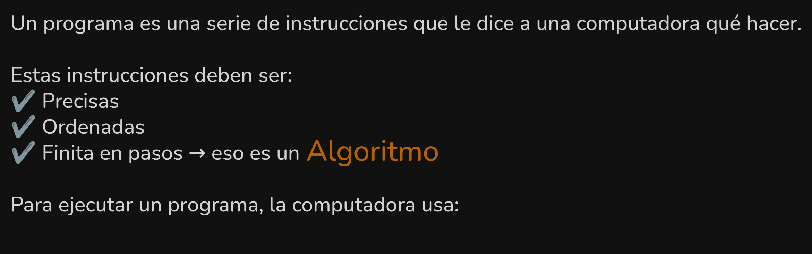
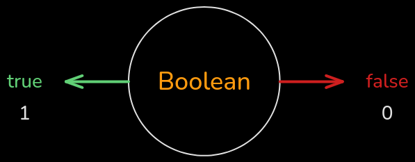
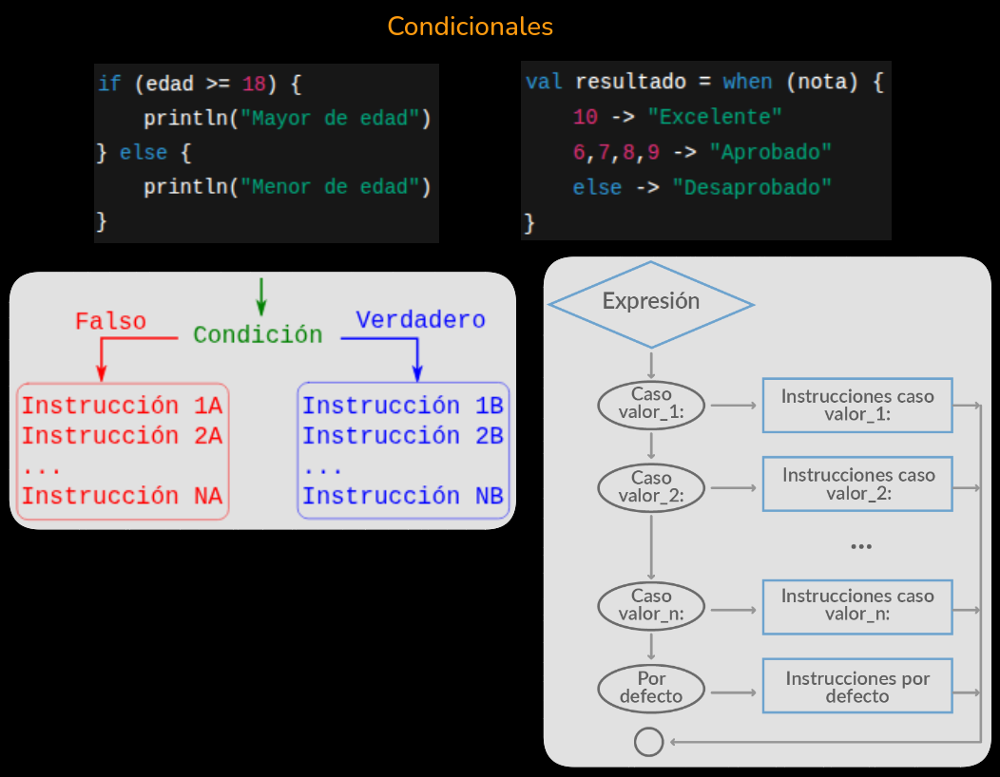

# Resumen general - Kotlin
- [¿Qué es un programa?](#qué-es-un-programa)
- [🧑🏻‍💻Para empezar a programar](#para-empezar-a-programar)
- [▶️​ `fun main()` - Función principal](#%EF%B8%8F-fun-main---función-principal)
- [🖨️​ `println()` - Imprimir por terminal](#%EF%B8%8F-println---imprimir-por-terminal)
- [🌱 Introducción a las Variables](#-introducción-a-las-variables)
- [🔁 `var` vs `val` — Mutabilidad](#var-vs-val-mutabilidad)
- [🧠 ¿Por qué necesitamos representar datos?](#-por-qué-necesitamos-representar-datos)
- [🔢 Tipos de Datos Básicos](#-tipos-de-datos-básicos)
- [🧮 Operadores en Kotlin](#-operadores-en-kotlin)
- [🧑‍💻 `readln()` – Leer datos del usuario](#-readln--leer-datos-del-usuario)
- [🔄 Casteo de tipos](#-casteo-de-tipos)
- [🧭 Estructuras de Control](#-estructuras-de-control)
- [🛠 Funciones Personalizadas](#-funciones-personalizadas)
- [✨ Ejercicios de repaso](#-ejercicios-de-repaso)
- [👨‍🎓 Programación Orientada a Objetos (POO)](#-programación-orientada-a-objetos-poo)
- [🧩 Clasificación general de clases en Kotlin](#-clasificación-general-de-clases-en-kotlin)

## ¿Qué es un programa?


Pero... la CPU no entiende lenguaje humano. Por lo que necesitamos escribir instrucciones en un lenguaje que la máquina pueda entender:


## 🧑🏻‍💻Para empezar a programar
### IDE (Entorno de Desarrollo Integrado)
Para compilar y ejecutar nuestro código vamos a utilizar el IDE oficial para Android:
### Android Studio

[Descargar Android Studio desde su página oficial](https://developer.android.com/studio?hl=es-419)
Una vez descargado se debe de instalar y crear un proyecto de la siguiente forma:
[Crear proyecto y archivos en Android Studio](Crear%20proyecto%20y%20archivos%20en%20Android%20Studio.md)

O en su defecto (también para realizar pruebas rápidas):
### Kotlin Playground

[Kotlin Playground](https://play.kotlinlang.org/)

Una vez dentro podemos empezar a programar...
## ▶️​ `fun main()` - Función principal
Es donde empieza nuestro programa (Punto de entrada)

> Comentarios: Son líneas que se ignoran / no se ejecutan. Se utilizan para documentar el código. 

## 🖨️​ `println()` - Imprimir por terminal


¡Con esto hicimos nuestro primer programa!

---

## 🌱 Introducción a las Variables

Cuando programamos, muchas veces necesitamos **guardar información** para poder usarla después.  
Esa información puede ser un número, un texto, un resultado de una cuenta, entre otras cosas.

Para **almacenar datos**, usamos **variables**.
- [🧃 ¿Qué es una variable?](#-qué-es-una-variable)
- [📝 ¿Cómo se crea una variable?](#-cómo-se-crea-una-variable)
- [🧠 ¿Para qué sirven?](#-para-qué-sirven)
- [🔁 `var` vs `val` — Mutabilidad](#-var-vs-val--mutabilidad)

### 🧃 ¿Qué es una variable?

Una **variable** es como una **caja con nombre**, donde guardamos algo para poder usarlo más adelante.

```kotlin
fun main() {
    var numero = 5
    println(numero)
}
```

📦 En este ejemplo:

- `numero` es el **nombre** de la caja (la variable).
    
- `5` es el **valor** que estamos guardando.
    
- `println(numero)` muestra ese valor en la terminal.

---

### 🔁 Podemos usar la variable en operaciones

```kotlin
fun main() {
    var numero = 5
    println(2 + numero)  // Imprime 7
}
```

La computadora:

1. Ve que `numero` vale `5`
    
2. Suma `2 + 5`
    
3. Muestra el resultado: `7`

---

### 📝 ¿Cómo se crea una variable?

En Kotlin usamos esta forma:

```kotlin
var nombreDeLaVariable = valor
```

✅ `var`: significa que la variable **puede cambiar**  
🧾 `nombreDeLaVariable`: le ponemos un **nombre claro**  
📦 `= valor`: guardamos un **dato** en la variable

---

### ✍️ Otro ejemplo simple:

```kotlin
fun main() {
    var saludo = "Hola"
    println(saludo)
}
```

💡 Esto va a mostrar: `Hola`

---
### 🧠 ¿Para qué sirven?

Las variables nos permiten:

- Guardar datos que se usan muchas veces
    
- Hacer cálculos con esos datos
    
- Organizar mejor nuestro código

---

## 🔁 `var` vs `val` — Mutabilidad

En Kotlin hay **dos formas** de crear variables, y la diferencia es muy importante:

| Palabra clave | ¿Se puede cambiar su valor? | Se usa para...                    |
| ------------- | --------------------------- | --------------------------------- |
| `var`         | ✅ **Sí**                    | Datos que pueden cambiar          |
| `val`         | ❌ **No**                    | Datos que no cambian (constantes) |
- [🎯 ¿Cuándo usar `var` y cuándo `val`?](#-cuándo-usar-var-y-cuándo-val)
---

### 🧪 Veamos un ejemplo con `var` (variable que **cambia**):

```kotlin
fun main() {
    var numero = 10
    println(numero)    // Muestra 10
    numero = 20
    println(numero)    // Muestra 20
}
```

📌 Primero guardamos el número `10`, pero **luego lo cambiamos a `20`**.

---

### 🚫 Ahora probemos con `val` (valor **fijo**):

```kotlin
fun main() {
    val nombre = "Maxi"
    println(nombre)
    nombre = "Juan" // ❌ Esto da error
}
```

💥 Este código **no funciona** porque `val` no permite cambiar el valor después de asignarlo.  
Es como una **caja sellada**: podés guardar algo una vez, pero no lo podés cambiar.

---

### 🎯 ¿Cuándo usar `var` y cuándo `val`?

- Usá `val` cuando **sabés que el valor no va a cambiar** (por ejemplo: tu nombre, una fecha de nacimiento).
    
- Usá `var` cuando **el valor puede cambiar** (por ejemplo: la cantidad de puntos en un juego, la edad, un número que se incrementa, etc).

---

✅ **Buenas prácticas**:  
Siempre que puedas, usá `val`. Es más seguro y ayuda a que tu código sea más fácil de entender.

---

## 🧠 ¿Por qué necesitamos representar datos?

Antes de programar, debemos representar la información del mundo real de forma que la computadora pueda entenderla.

Para eso usamos los **tipos de datos**, que nos permiten modelar **números, texto, decisiones, colecciones**, etc.

### 🧰 Kotlin

- Es un lenguaje **fuertemente tipado** (el tipo siempre se respeta)
    
- Puede **inferir automáticamente** el tipo según el valor que le asignamos


---

## 🔢 Tipos de Datos Básicos

En Kotlin existen varios **tipos de datos primitivos**. Vamos a ver los más usados en esta etapa:
- [✅ Boolean (Lógico)](#-boolean-lógico)
- [🔤 Char y String (Texto)](#-char-y-string-texto)
- [🔢 Números Enteros](#-números-enteros)
- [🔢 Números con Decimales (Punto flotante)](#-números-con-decimales-punto-flotante)
- [🎒 Resumen](#-resumen)

---

### ✅ Boolean (Lógico)

📦 Representa valores **verdadero o falso**. Solo puede ser:

- `true` (verdadero)
    
- `false` (falso)

```kotlin
fun main() {
    val esMayor = true // Kotlin infiere que la variable es Boolean
    println(esMayor)
    var prendido: Boolean = false // Se utilizan : para indicar el tipo de dato
}
```


---

### 🔤 Char y String (Texto)

- **Char**: representa **un solo carácter** entre comillas simples (`'A'`, `'%'`)
    
- **String**: representa una **cadena de texto** entre comillas dobles (`"Hola mundo!"`)

```kotlin
fun main() {
    val inicial: Char = 'M'
    val saludo: String = "Hola Maxi"
    println(inicial)
    println(saludo)
}
```


---

### 🔢 Números Enteros

Usamos enteros cuando **no necesitamos decimales**. Los más comunes:

| Tipo    | Ejemplo       | Rango aproximado |
| ------- | ------------- | ---------------- |
| `Byte`  | 127           | -128 a 127       |
| `Short` | 32767         | -32.768 a 32.767 |
| `Int`   | 2_147_483_647 | -2³¹ a 2³¹ - 1   |
| `Long`  | 9 trillones   | -2⁶³ a 2⁶³ - 1   |

```kotlin
fun main() {
    val edad: Int = 25
    val año: Short = 2025
    println(edad)
    println(año)
    var numero = 150 // Kotlin infiere que es Int
    println(numero)
}
```


---

### 🔢 Números con Decimales (Punto flotante)

Cuando necesitamos representar **números con parte decimal**, usamos:

|Tipo|Precisión|Ejemplo|
|---|---|---|
|`Float`|Simple (32 bits)|3.14f|
|`Double`|Alta (64 bits)|3.1415926535|

```kotlin
fun main() {
    val temperatura: Float = 36.6f
    val pi: Double = 3.1415926535
    println(temperatura)
    println(pi)
}
```

⚠️ ¡Ojo! Los `Float` deben terminar en **`f`**.


---

### 🧮 Tip Extra: Notación científica

Los números muy grandes o muy pequeños se representan así:
$$250000 = 2.5 \times 10^{5}$$  

$$0.00008 = 8.0 \times 10^{-5}$$


---

### 🎒 Resumen

|Tipo|¿Qué representa?|Ejemplo|
|---|---|---|
|`Boolean`|Verdadero o falso|`true`|
|`Char`|Un carácter|`'A'`|
|`String`|Texto|`"Hola"`|
|`Int`|Número entero|`42`|
|`Float`|Número decimal (simple)|`3.14f`|
|`Double`|Número decimal (preciso)|`3.1415926535`|

---
## 🧮 Operadores en Kotlin

Los operadores nos permiten **realizar operaciones** con los datos que guardamos en las variables.  
Pueden ser operaciones matemáticas, comparaciones o decisiones lógicas.
- [➕ Operadores Matemáticos](#-operadores-matemáticos)
- [🧪 Operadores de Comparación](#-operadores-de-comparación)
- [🔗 Operadores Lógicos](#-operadores-lógicos)
- [🎓 Ejemplo integrador](#-ejemplo-integrador)
- [🧠 Tip: Evaluación de expresiones](#-tip-evaluación-de-expresiones)

---
### ➕ Operadores Matemáticos

Sirven para **realizar cálculos numéricos**.

|Operador|Significado|Ejemplo|
|---|---|---|
|`+`|Suma|`5 + 3` → `8`|
|`-`|Resta|`10 - 4` → `6`|
|`*`|Multiplicación|`2 * 3` → `6`|
|`/`|División|`10 / 2` → `5`|
|`%`|Módulo (resto)|`7 % 3` → `1`|

```kotlin
fun main() {
    val resultado = 10 % 3
    println(resultado) // Imprime 1
}
```


---
### 🧪 Operadores de Comparación

Nos permiten comparar valores.  
**Devuelven siempre un resultado Boolean** (`true` o `false`).

|Operador|Significado|Ejemplo|
|---|---|---|
|`==`|Igualdad|`5 == 5` → `true`|
|`!=`|Desigualdad|`5 != 3` → `true`|
|`>`|Mayor que|`7 > 2` → `true`|
|`<`|Menor que|`3 < 4` → `true`|
|`>=`|Mayor o igual que|`5 >= 5` → `true`|
|`<=`|Menor o igual que|`4 <= 6` → `true`|

```kotlin
fun main() {
    val edad = 18
    println(edad >= 18)  // Imprime true
}
```


---
### 🔗 Operadores Lógicos

Se usan para combinar condiciones.  
También **devuelven un valor boolean** (`true` o `false`).

| Operador  | Nombre  | Ejemplo              | Resultado |
| --------- | ------- | -------------------- | --------- |
| **&&**    | **AND** | **true && false**    | `false`   |
| **\| \|** | **OR**  | **false \| \| true** | `true`    |
| **!**     | **NOT** | **!true**            | `false`   |

```kotlin
fun main() {
    val mayorEdad = true
    val tieneDNI = false
    println(mayorEdad && tieneDNI) // false
}
```

📌 **AND (`&&`)**: Solo da `true` si ambas condiciones son verdaderas  
📌 **OR (`||`)**: Da `true` si **al menos una** es verdadera  
📌 **NOT (`!`)**: Invierte el valor (`true` → `false`, y viceversa)


---
### 🎓 Ejemplo integrador

```kotlin
fun main() {
    val edad = 20
    val tieneDNI = true
    val puedeEntrar = edad >= 18 && tieneDNI
    println("¿Puede entrar? $puedeEntrar") // Imprime ¿Puede entrar? true
}
```

---
## 🧠 Tip: Evaluación de expresiones

Kotlin **evalúa de izquierda a derecha**, pero respeta **prioridades**:

1. `()` Paréntesis
    
2. `!` Negación lógica
    
3. `*`, `/`, `%`
    
4. `+`, `-`
    
5. Comparaciones (`==`, `<`, etc.)
    
6. Lógicos (`&&`, `||`)

Usá paréntesis para **asegurar el orden** y que el código sea más claro.

---
## 🧑‍💻 `readln()` – Leer datos del usuario

Hasta ahora, los datos los escribíamos directamente en el código.  
Pero muchas veces queremos que el **usuario los escriba en la terminal**. Para eso usamos:

```kotlin
val nombre = readln()
```

🧪 Este comando **lee una línea de texto desde la terminal**. Siempre devuelve un `String`.

```kotlin
fun main() {
    println("¿Cómo te llamás?")
    val nombre = readln()
    println("Hola, $nombre!")
}
```


---

### 🔄 Casteo de tipos

Como `readln()` devuelve siempre un `String`, si queremos convertir ese texto a número usamos:

|Conversión|Función|
|---|---|
|Texto a `Int`|`.toInt()`|
|Texto a `Float`|`.toFloat()`|
|Texto a `Double`|`.toDouble()`|
|Texto a `Boolean`|`.toBoolean()`|

```kotlin
fun main() {
    println("¿Qué edad tenés?")
    val edad = readln().toInt()
    println("El año que viene tendrás ${edad + 1}")
}
```

⚠️ Si el usuario ingresa un valor no numérico, el programa lanza un error.

---
## 🧭 Estructuras de Control

Nos permiten **tomar decisiones** o **repetir acciones**.
### 📚 Tipos de estructuras

| Tipo                                                                                             | ¿Para qué sirve?                |
| ------------------------------------------------------------------------------------------------ | ------------------------------- |
| [🔹 Secuencial](#-secuencial)                                                                     | Ejecutar instrucciones en orden |
| [🔸 Condicionales (`if` / `else`) y Selección (`when`)](#-condicionales-if--else-y-selección-when) | Ejecutar según una condición    |
| [🔁 Iteración (`while`) y Repetición (`for`)](#-iteración-while-y-repetición-for)                 | Repetir mientras se cumpla algo |


---

### 🔹 Secuencial

Se ejecutan **una después de la otra**, en orden.

```kotlin
fun main() {
    println("Nombre:")
    val nombre = readln()
    println("Hola, $nombre!")
}
```


---

### 🔸 Condicionales (`if` / `else`) y Selección (`when`)

Sirven para **tomar decisiones** según una condición.

```kotlin
fun main() {
    val edad = readln().toInt()
    if (edad >= 18) {
        println("Mayor de edad")
    } else {
        println("Menor de edad")
    }
}
```

También podés usar `when`, que reemplaza varios `if` seguidos:

```kotlin
val resultado = when (nota) {
    10 -> "Excelente"
    7,8,9 -> "Muy bien"
    6 -> "Aprobado"
    else -> "Desaprobado"
}
```



---
### 🔁 Iteración (`while`) y Repetición (`for`)

#### 🌀 `while`: itera un bloque de código mientras una condición sea verdadera (puede no conocerse la cantidad de iteraciones)

```kotlin
var i = 0
while (i < 3) {
    println(i)
    i++
}
```

#### 📦 `for`: repite un bloque de código las veces que se le indique, por ejemplo: recorrer un rango (se conoce la cantidad de iteraciones)

```kotlin
for (i in 1..5) {
    println(i)
}
```


---
## 🛠 Funciones Personalizadas

Hasta ahora usamos funciones pre-definidas como `println()`, `readln()`, etc, pero también podemos **crear nuestras propias funciones** para reutilizar código!

```kotlin
fun saludar(nombre: String): String {
    return "Hola, $nombre!"
}

fun main() {
    val mensaje = saludar("Maxi") //Para llamar a una función nombre(parámetros)
    println(mensaje)
}
```

📦 Una función tiene:

- `fun` + nombre
    
- Parámetros entre `()`
    
- Tipo de retorno (opcional)
    
- Un `return` si queremos devolver un valor

También pueden **no retornar nada**:

```kotlin
fun mostrar() {
    println("Esto no retorna nada")
}
```


---
## ✨ Ejercicios de repaso

**Objetivo:** reforzar lo visto hasta ahora: funciones, `readln()`, tipos de datos, estructuras de control (`if`, `when`, `while`, `for`) y casteo de tipos.

### ✅ Ejercicios propuestos

#### 1. Ingreso de datos básicos

**Enunciado:** Pedir al usuario su nombre, edad y altura. Luego imprimir un mensaje como:

> Hola `nombre`, tenés `edad` años y medís `altura` metros.

**Pista:** recordá que los valores ingresados son `String`. Usá `toInt()` y `toFloat()` si necesitás convertirlos.

---

#### 2. Mayoría de edad

**Enunciado:** A partir de la edad ingresada, imprimir si es mayor o menor de edad.

**Pista:** si la `edad` es `mayor o igual` a 18...

---

#### 3. Clasificación de nota

**Enunciado:** Ingresar una nota del 0 al 10 y mostrar el resultado con `when`:

- 10: Excelente
    
- 7 a 9: Aprobado
    
- 0 a 6: Desaprobado

**Pista:** podés usar rangos como `in 7..9`

---

#### 4. Contador ascendente

**Enunciado:** Usar un `for` que imprima los números del 1 al 10.

---

#### 5. Contador descendente

**Enunciado:** Usar `while` para imprimir desde 5 hasta 1.

**Pista:** inicializá una variable con 5 y restale 1 en cada iteración.

---

#### 6. Promedio de notas

**Enunciado:** Ingresar 3 notas (pueden tener decimales), calcular el promedio y mostrarlo  

**Pista:** recordá que el promedio es la suma de los valores dividido la cantidad de valores

---

## 👨‍🎓 Programación Orientada a Objetos (POO)
- [✨ Introducción](#-introducción)
- [📚 Conceptos clave](#-conceptos-clave)
- [📝 ¿Cómo se crea una clase?](#-cómo-se-crea-una-clase)
- [🚗 Ejemplo: Clase `Auto`](#-ejemplo-clase-auto)
- [📒 Constructor principal](#-constructor-principal)
- [🧰 Funciones vs Métodos](#-funciones-vs-métodos)
- [🧬 Herencia](#-herencia)
- [🎓 Ejercicios de POO](#-ejercicios-de-programación-orientada-a-objetos)
### ✨ Introducción

> La POO es un paradigma de programación que permite modelar el mundo real mediante **objetos**.

En Kotlin, los objetos se crean a partir de **clases**, que definen su estructura interna:

- **Atributos**: representan el _estado_ del objeto (como variables).
    
- **Métodos**: representan su _comportamiento_ (como funciones).

---

### 📚 Conceptos clave

#### 📊 Objeto

Entidad que representa algo del mundo real. Tiene:

- **Estado:** atributos (variables internas)
    
- **Comportamiento:** métodos (funciones internas)

#### 💼 Clase

Es una _plantilla_ para crear objetos. Define:

- Qué atributos tendrán
    
- Qué métodos compartirán los objetos de esa clase

---
### 📝 ¿Cómo se crea una clase?
en Kotlin usamos esta forma:

```Kotlin
class NombreDeLaClase(var atrib1: String, val atrib2: Int){
	var atribFueraDelConstructor = 0

	fun metodo1(param1: String): String {
		return "parametro 1: $param1"
	}

	fun metodo2() { println("Holaaa") }
}
```
#### 📊 Instanciamos la clase

```Kotlin
fun main() {
	val miObjeto = NombreDeLaClase("Atributo1", 264)
	miObjeto.metodo1("Llamo al método 1")
	miObjeto.atribFueraDeConstructor = 20
	miObjeto.metodo2()
}
```

---
### 🚗 Ejemplo: Clase `Auto`

```kotlin
class Auto(val marca: String, val modelo: String, var color: String) {
	// Atributos en el constructor principal ↑ para instanciar el objeto
    var velocidad = 0 // Atributos que no son necesarios en el constructor

	// Métodos
    fun acelerar() {
        velocidad += 10
        println("Velocidad actual: $velocidad km/h")
    }

    fun frenar() {
        velocidad = 0
        println("Auto detenido.")
    }
}
```

#### ⚡ Uso del objeto

```kotlin
fun main() {
    val miAuto = Auto("Ford", "Mustang", "Azul")
    
    println("Color: ${miAuto.color}") // Imprime -> Color: Azul
    println("Marca: ${miAuto.marca}") // Imprime -> Marca: Ford

    miAuto.acelerar() // Imprime -> Velocidad actual: 10 km/h
    miAuto.frenar() // Imprime -> Auto detenido.
}
```

---
### 📒 Constructor principal

El constructor sirve para instanciar (crear) objetos con valores iniciales.

```kotlin
class Persona(val nombre: String, var edad: Int) {
    fun saludar() {
        println("Hola, me llamo $nombre.")
    }

    fun cumplirAnios() {
        edad++
        println("Ahora tengo $edad años.")
    }
}
```

---
### 🧰 Funciones vs Métodos

- **Función**: existe por fuera de las clases

```kotlin
fun saludar(nombre: String) = "Hola $nombre" // El = reemplaza al return
```

- **Método**: está definido dentro de una clase

```kotlin
class Persona(val nombre: String) {
    fun saludar() = "Hola soy $nombre" // El = reemplaza al return
}
```

---
## 🧬 Herencia

Podemos extender clases existentes para reutilizar sus atributos y métodos.

- Para eso se utiliza la palabra clave `open` antes de `class` en la **clase padre** para que esta permita extenderse.
- Y luego del constructor principal de la **clase hija** se agregan `:`  seguidos del constructor de la **clase padre**

```kotlin
open class Animal(val nombre: String) {
    fun dormir() = println("Zzz...")
}

class Perro(nombre: String) : Animal(nombre) {
    fun ladrar() = println("Guau!")
}
```
  

El perro tiene **todo lo de su clase padre (Animal)** y además el método propio **`ladrar()`**

---

## 🎓 Ejercicios de Programación Orientada a Objetos

### 1. Clase `CuentaBancaria`

**Enunciado:**

- Crear una clase `CuentaBancaria` con:
    
    - Atributos: `titular: String`, `saldo: Double`
        
    - Métodos:
        
        - `depositar(cantidad: Double)`
            
        - `extraer(cantidad: Double)`
            
        - `mostrarSaldo()`

**Pista:** validá que no se pueda extraer más de lo que hay.

---

### 2. Clase `Rectangulo`

**Enunciado:**

- Crear una clase `Rectangulo` con:
    
    - Atributos: `base: Int`, `altura: Int`
        
    - Métodos:
        
        - `area()` que devuelva el área
            
        - `perimetro()` que devuelva el perímetro
            
**Pista:** recordá que:  `área = base * altura` y `perímetro = suma de los lados`

---

### 3. Herencia: `Empleado` y `Gerente`

**Enunciado:**

- Crear clase padre `Empleado(nombre, sueldo)` con método `mostrarDatos()`
    
- Crear clase hija `Gerente` que agrega un atributo `departamento` y sobreescriba `mostrarDatos()` para incluirlo

**Pista:** para sobreescribir un método de la clase padre se usa lo siguiente:
```Kotlin
open class ClasePadre {  
    open fun metodoDeClasePadre(){  
        println("Holaaa!")  
    }  
}

class ClaseHija : ClasePadre() {  
    override fun metodoDeClasePadre(){  
        super.metodoDeClasePadre() // Imprime "Holaaa!"  
        println("Mundooo!")  // Imprime "Mundooo!"
    }  
}
```

---

### 4. Clase `Alumno`

**Enunciado:**

- Crear una clase `Alumno(nombre, notas: List<Float>)`
    
- Método `promedio()` que calcule el promedio de notas
    
- Método `aprobo()` que devuelva `true` si el promedio es mayor o igual a 6

**Pista:** usá `notas.average()`

---

### 5. Crear una clase propia

**Desafío libre:** Inventá una clase propia (como `Libro`, `Videojuego`, `Mascota`, etc.) que tenga:

- Al menos 3 atributos
    
- Al menos 2 métodos
    
- Y creá al menos 1 objeto con ella en `main()`
---

## 🧩 Clasificación general de clases en Kotlin

| Tipo de clase      | Finalidad principal                                                        |
| ------------------ | -------------------------------------------------------------------------- |
| `class`            | Definir objetos comunes con atributos y comportamientos                    |
| `abstract class`   | Crear estructuras base con métodos y propiedades incompletas o comunes     |
| `interface`        | Definir contratos (qué se puede hacer) sin implementación obligatoria      |
| `data class`       | Representar datos con generación automática de funciones como `toString()` |
| `enum class`       | Enumerar valores constantes con posibles propiedades y métodos             |
| `object`           | Crear un singleton (una única instancia)                                   |
| `companion object` | Crear miembros "estáticos" dentro de una clase                             |
| `nested class`     | Clases anidadas sin acceso a la clase exterior                             |
| `inner class`      | Clases anidadas con acceso a la clase exterior                             |
| `sealed class`     | Modelar jerarquías cerradas (tipos restringidos) para usar con `when`      |

---

## 1. `class`: Clases comunes

🔸 **Uso:** Modelar objetos con estado y comportamiento.

```kotlin
class Persona(val nombre: String, var edad: Int) {
    fun saludar() = println("Hola, soy $nombre y tengo $edad años")
}
```

### 🧪 Ejercicio:

* Crear una clase `Auto` con marca, modelo y año. Agregar un método `mostrarInfo()`.

---

## 2. `abstract class`: Clases abstractas

🔸 **Uso:** Clase base que no se puede instanciar, con métodos comunes y abstractos.

```kotlin
abstract class Animal {
    abstract fun hacerSonido()
    fun respirar() = println("Respirando...")
}

class Perro : Animal() {
    override fun hacerSonido() = println("Guau guau")
}
```

### 🧪 Ejercicio:

* Crear una clase abstracta `Instrumento` con método abstracto `tocar()`.
* Implementar dos clases: `Guitarra` y `Bateria`.

---

## 3. `interface`: Interfaces

🔸 **Uso:** Definir contratos sin estado (o con propiedades `val`) y múltiples implementaciones.

```kotlin
interface Reproducible {
    fun reproducir()
}

class Cancion : Reproducible {
    override fun reproducir() = println("Reproduciendo canción...")
}
```

✔️ Una clase puede implementar **más de una interfaz**.

### 🧪 Ejercicio:

* Crear una interfaz `Volador` con método `volar()`.
* Implementar `Volador` en las clases `Pajaro` y `Avion`.

---

## 4. `data class`: Clases de datos

🔸 **Uso:** Representar estructuras que solo contienen datos.

```kotlin
data class Producto(val nombre: String, val precio: Double)
```

✔️ Automáticamente implementa `equals()`, `hashCode()`, `toString()`, `copy()` y `componentN()`.

### 🧪 Ejercicio:

* Crear una `data class` llamada `Libro` con `titulo`, `autor` y `añoPublicacion`.
* Probar el método `copy()` para hacer una copia cambiando el año.

---

## 5. `enum class`: Enumeraciones

🔸 **Uso:** Definir un conjunto fijo de constantes, con comportamiento opcional.

```kotlin
enum class Dia {
    LUNES, MARTES, MIERCOLES
}
```

✔️ Pueden tener **propiedades y métodos**:

```kotlin
enum class Prioridad(val nivel: Int) {
    BAJA(1), MEDIA(2), ALTA(3);
    
    fun esCritica() = this == ALTA
}
```

### 🧪 Ejercicio:

* Crear un enum `ColorSemaforo` con valores `ROJO`, `AMARILLO`, `VERDE`.
* Agregar una función `accion()` que devuelva un texto según el color.

---

## 6. `object`: Singleton

🔸 **Uso:** Instancia única. Muy útil para controladores o servicios.

```kotlin
object Logger {
    fun log(msg: String) = println("Log: $msg")
}
```

✔️ No necesita ser instanciado, se usa directamente: `Logger.log("Iniciando...")`

### 🧪 Ejercicio:

* Crear un objeto `Contador` con una variable `total` y métodos `incrementar()` y `mostrar()`.

---

## 7. `companion object`: Miembros estáticos

🔸 **Uso:** Asociar métodos/constantes a la clase, no a la instancia.

```kotlin
class Usuario(val nombre: String) {
    companion object {
        const val SALUDO = "Hola"
        fun crearInvitado() = Usuario("Invitado")
    }
}
```

✔️ Se accede con `Usuario.SALUDO` o `Usuario.crearInvitado()`

### 🧪 Ejercicio:

* Crear clase `Cuenta` con companion que tenga un método `generarNumeroCuenta()`.

---

## 8. `nested class`: Clases anidadas

🔸 **Uso:** Clase dentro de otra que **NO puede acceder a sus miembros externos**.

```kotlin
class Computadora(val marca: String) {
    class Procesador(val modelo: String) {
        fun infoComputadora(computadora: Computadora): String {
            return "Procesador $modelo de ${computadora.marca}"
        }
    }
}
```

✔️ No necesita una instancia de la clase externa para instanciarse.

### 🧪 Ejercicio:

* Crear una clase `Universidad` con una clase anidada `Curso`. Mostrar cómo acceder al nombre de la universidad desde el curso.

---

## 9. `inner class`: Clases internas

🔸 **Uso:** Clase dentro de otra que **puede acceder a sus miembros externos**.

```kotlin
class Computadora(val marca: String) {
    inner class Procesador(val modelo: String) {
        fun info() = "Procesador $modelo de $marca"
    }
}
```

✔️ Necesita una instancia de la clase externa para instanciarse.

### 🧪 Ejercicio:

* Crear clase `Empresa` con una clase interna `Empleado`. Mostrar cómo acceder al nombre de la empresa desde el empleado.

---

## 10. `sealed class`: Clases selladas

🔸 **Uso:** Modelar jerarquías de clases limitadas. Muy útil para representar estados en `when` sin necesidad de `else`.

```kotlin
sealed class Resultado
data class Exito(val datos: String) : Resultado()
data class Error(val mensaje: String) : Resultado()
object Cargando : Resultado()
```

```kotlin
fun manejarResultado(r: Resultado) = when (r) {
    is Exito -> println("Datos: ${r.datos}")
    is Error -> println("Error: ${r.mensaje}")
    Cargando -> println("Cargando...")
}
```

### 🧪 Ejercicio:

* Modelar una clase sellada `Operacion` con `Suma`, `Resta` y `Multiplicacion`, y procesarla con un `when`.

---

## 📌 Diferencias clave entre tipos

| Tipo               | Puede instanciarse | Tiene estado    | Herencia      | Uso principal                               |
| ------------------ | ------------------ | --------------- | ------------- | ------------------------------------------- |
| `class`            | ✔️                 | ✔️              | ✔️            | Objetos comunes                             |
| `abstract class`   | ❌ (directamente)   | ✔️              | ✔️ (solo 1)   | Base para clases hijas                      |
| `interface`        | ❌                  | ❌ (por defecto) | ✔️ (múltiple) | Definir contratos                           |
| `data class`       | ✔️                 | ✔️              | ❌             | Almacenar datos                             |
| `enum class`       | ✔️                 | ✔️              | ❌             | Conjunto de constantes                      |
| `object`           | ✔️ (automático)    | ✔️              | ❌             | Singleton                                   |
| `companion object` | ✔️ (internamente)  | ✔️              | ❌             | Lógica compartida/estática dentro de clases |
| `nested class`     | ✔️                 | ✔️              | ✔️            | Subclase sin acceso a la clase externa      |
| `inner class`      | ✔️                 | ✔️              | ✔️            | Subclase con acceso a la clase externa      |
| `sealed class`     | ❌ (directamente)   | ✔️              | ✔️ (limitada) | Modelado de estados limitados               |

---
